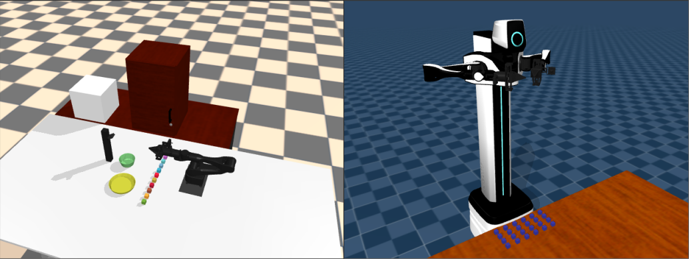
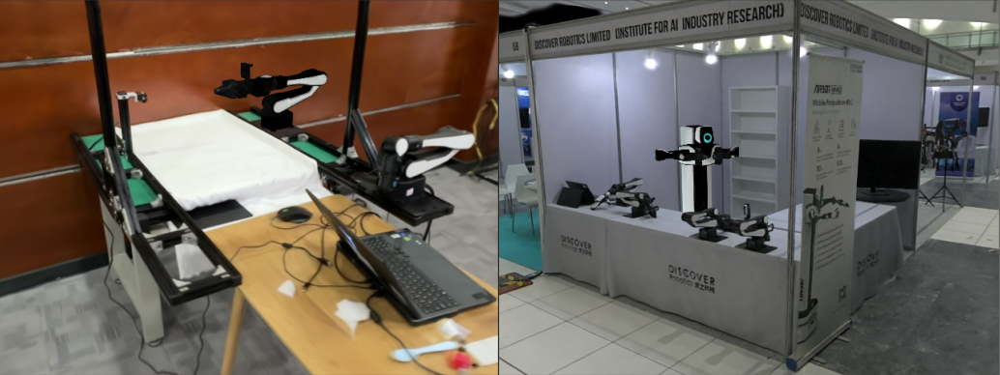

# DLABSIM

## Install

```bash
cd DLabSim
pip install -r requirements.txt
pip install -e .
### If there is a network problem:
# pip install -r requirements.txt -i https://pypi.tuna.tsinghua.edu.cn/simple
# pip install -e . -i https://pypi.tuna.tsinghua.edu.cn/simple
```

如果需要真实感渲染，请参考[3dgs](https://github.com/graphdeco-inria/gaussian-splatting),安装cuda。
```bash
pip install -r requirements_gs.txt
cd submodules
unzip diff-gaussian-rasterization
cd ..
pip install submodules/diff-gaussian-rasterization # 这一步之前确保安装了cuda
```

## Test

```bash
cd DLabSim/dlabsim/envs
python airbot_play_base.py

# 碰撞检测demo
dlabsim/examples/collision_detection/mmk2_collision_detection.ipynb
```

### Usage
- Press 'h' to print help
- Press 'q' to quit the program
- Press 'r' to reset the state
- Press '[' or ']' to switch camera view
- Press 'Esc' to set free camera
- Press 'p' to print the rotot state



真实感渲染



## Tools

-   `convex decomposition`
-   `urdf format`
-   `3DGS .ply converter`
-   `3DGS .ply transposer`
-   [`obj2mjcf`](https://github.com/kevinzakka/obj2mjcf)

- use simulate in terminal
    ```
    cd ~
    mkdir .mujoco
    wget https://github.com/google-deepmind/mujoco/releases/download/3.2.0/mujoco-3.2.0-linux-x86_64.tar.gz
    tar -zxvf mujoco-3.2.0-linux-x86_64.tar.gz
    cd /usr/bin
    sudo ln -s <YOUR-HOME-PATH>/.mujoco/mujoco-3.2.0/bin/simulate simulate
    ```
    
- 测试功能
    - [背包同步](doc/背包.md)